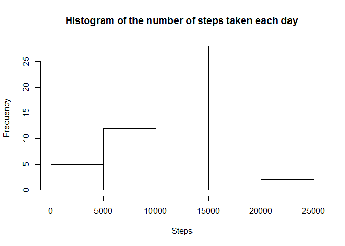
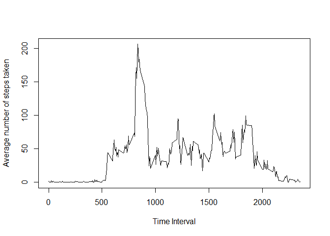
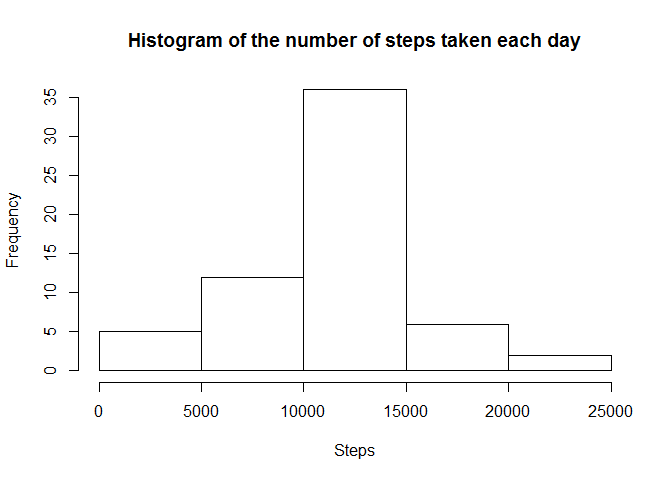
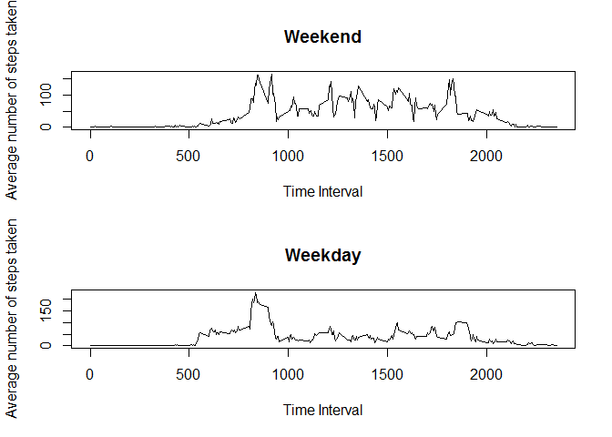

# Reproducible Research: Peer Assessment 1


## Loading and preprocessing the data


```r
library(dplyr)
```

```
## 
## Attaching package: 'dplyr'
```

```
## The following objects are masked from 'package:stats':
## 
##     filter, lag
```

```
## The following objects are masked from 'package:base':
## 
##     intersect, setdiff, setequal, union
```

```r
activity <- read.csv("activity.csv")
activity <- mutate(activity, datetime = as.POSIXct(date) + interval*60)
```

## What is mean total number of steps taken per day?


```r
activityNoNA <- activity[!is.na(activity$steps),]
stepsPerDay <- aggregate(steps ~ date, activityNoNA, sum)
hist(stepsPerDay$steps, main = "Histogram of the number of steps taken each day", xlab="Steps")
```

<!-- -->

```r
stepMean <- mean(stepsPerDay$steps)
stepMedian <- median(stepsPerDay$steps)
```
The mean total number of steps per day is 1.0766189\times 10^{4}

The median total number of steps per day is 10765

## What is the average daily activity pattern?


```r
stepsPerInterval <- aggregate(steps ~ interval, activityNoNA, mean)
plot(stepsPerInterval$interval,stepsPerInterval$steps, type="l", xlab="Time Interval",ylab="Average number of steps taken")
```

<!-- -->

```r
maxStepsIndex <- which.max(stepsPerInterval$steps)
interval <- stepsPerInterval$interval[maxStepsIndex]
```
The 5-minute interval, on average across all the days in the dataset, that contains the maximum number of steps is 835

## Imputing missing values


```r
numOfNA <- sum(is.na(activity$steps))
```
The total number of missing values is 2304


```r
replacedNA <- activity
# find the indicies of the NA values
ind <- which( is.na( replacedNA$steps ) )
# replace them with the mean for the corresponding interval
for(i in ind){
  replacedNA$steps[i] <- stepsPerInterval$steps[which(stepsPerInterval$interval == replacedNA$interval[i])]
}

stepsPerDay <- aggregate(steps ~ date, replacedNA, sum)
hist(stepsPerDay$steps, main = "Histogram of the number of steps taken each day", xlab="Steps")
```

<!-- -->

```r
stepMeanReplaced <- mean(stepsPerDay$steps)
stepMedianReplaced <- median(stepsPerDay$steps)
```
The mean total number of steps per day for the new data set is 1.0766189\times 10^{4}

The median total number of steps per day for the new data set is 1.0766189\times 10^{4}

Replacing the missing values with the interval mean has left the mean unchanged, but has shifted the median by 1.1886792

Imputting the missing data has increased the number of days which have a total number of steps in the range 10000 - 15000.


## Are there differences in activity patterns between weekdays and weekends?


```r
replacedNA$weekfactor <- ifelse(weekdays(replacedNA$datetime) %in% c("Saturday", "Sunday"), "weekend", "weekday")
stepsPerIntervalWeekday <- aggregate(steps ~ interval + weekfactor, replacedNA, mean)
par(mfrow=c(2,1))
weekendIndex <- which(stepsPerIntervalWeekday$weekfactor == "weekend")
weekdayIndex <- which(stepsPerIntervalWeekday$weekfactor == "weekday")
plot(stepsPerIntervalWeekday$interval[weekendIndex],stepsPerIntervalWeekday$steps[weekendIndex], type="l", xlab="Time Interval",ylab="Average number of steps taken", main="Weekend")
plot(stepsPerIntervalWeekday$interval[weekdayIndex],stepsPerIntervalWeekday$steps[weekdayIndex], type="l", xlab="Time Interval",ylab="Average number of steps taken", main="Weekday")
```

<!-- -->

